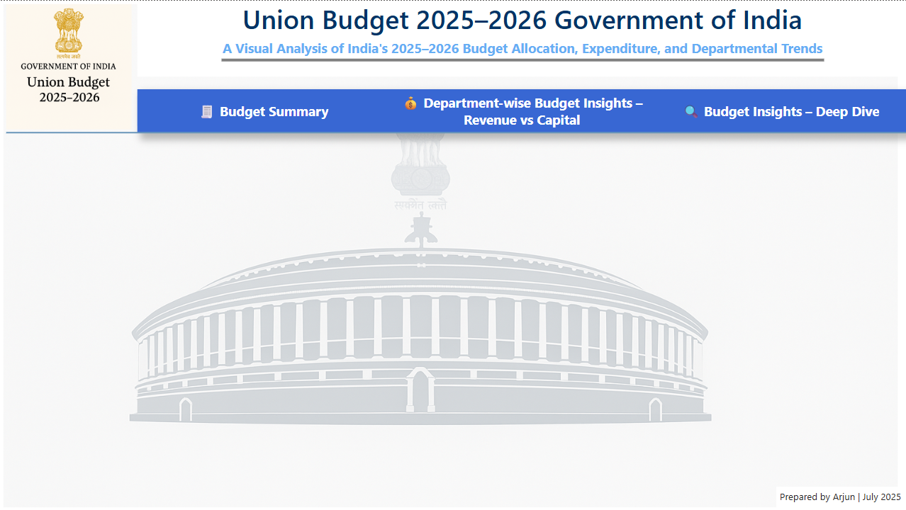

# 📊 Union Budget 2025–2026 Dashboard – Power BI

This project presents a comprehensive Power BI dashboard analyzing the **Government of India Budget for FY 2025–2026**. It provides insights into how funds are allocated across departments, compares budget vs actual trends, and highlights key growth areas in a visually interactive way.

---

## 📁 Files Included

| File Name                        | Description                                      |
|----------------------------------|--------------------------------------------------|
| `Budget 2025-2026.pbix`         | Power BI dashboard file                          |
| `Cleaned_Budget_2025_Final.csv` | Cleaned dataset used for visualization           |
| `preview.png`                   | Screenshot of the final dashboard (see below)    |

---

## 🔍 Dashboard Highlights

- 📘 **Budget Summary** page for key figures and overall allocation  
- 💰 **Department-wise Analysis** (Revenue vs Capital expenditure)  
- 🔍 **Deep Dive Insights** into sectoral performance and growth  
- 📊 Slicers and filters for interactivity and comparisons  
- 📐 Custom design with bookmarks, DAX, and KPI cards  

---

## 🛠 Tools & Technologies

- **Power BI**
- **DAX**
- **Excel** (for data preparation)
- **Data Cleaning & Transformation**

---

## 🧑‍🎓 Project Information

- 🎓 **Institute**: Imarticus Learning  
- 📅 **Timeline**: July 2025  
- 📁 **Project Type**: Capstone Project  
- 🧑‍💻 **Role**: Data Analyst  

---

## 📸 Dashboard Preview

---

## 📬 Contact

Feel free to connect or reach out for any feedback or collaboration:

- 📧 arjun.your@email.com  
- 🔗 [LinkedIn](https://linkedin.com/in/arjun9669)

---
